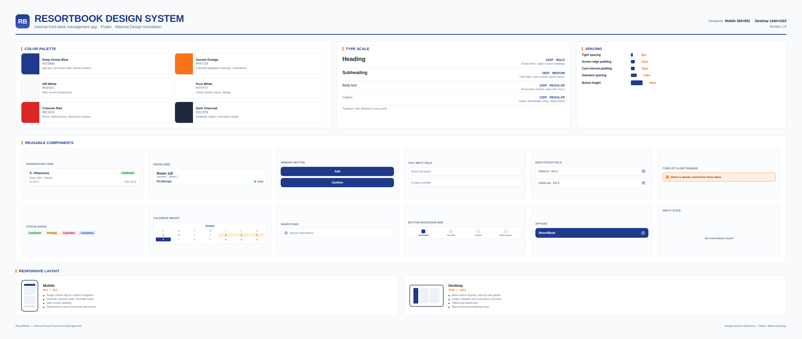

# Design system

The ResortBook design system defines the visual and interaction standards used throughout the application. It is designed for consistent use across both mobile and desktop layouts.

[Design system (PDF)](assets/ResortBook_Design_System.pdf)

## Palette

| Role               | Color                     | Used For                                                                            |
| ------------------ | ------------------------- | ----------------------------------------------------------------------------------- |
| Primary            | Deep Ocean Blue `#1E3A8A` | App bar, bottom navigation active state, primary buttons, selected navigation items |
| Secondary / Accent | Sunset Orange `#F97316`   | Calendar highlights, reservation warnings, important notifications                  |
| Background         | Off-White `#F8FAFC`       | Main screen background                                                              |
| Surface            | Pure White `#FFFFFF`      | Cards, reservation panels, input fields, dialogs, sheets                            |
| Error              | Crimson Red `#DC2626`     | Validation errors, failed actions, destructive buttons                              |
| Text               | Dark Charcoal `#1E293B`   | Headings, labels, reservation details, and room information                         |

## Type scale

| Style      |  Size | Weight  | Used For                                                |
| ---------- | ----: | ------- | ------------------------------------------------------- |
| Heading    | 24 sp | Bold    | Screen titles and major section headings                |
| Subheading | 18 sp | Medium  | Card titles, room names, and guest names                |
| Body       | 14 sp | Regular | Reservation details, room information, and form content |
| Caption    | 12 sp | Regular | Dates, timestamps, hints, and status labels             |

## Spacing

| Spacing Type          |  Size |
| --------------------- | ----: |
| Tight spacing         |  8 px |
| Standard spacing      | 24 px |
| Screen edge padding   | 16 px |
| Card internal padding | 16 px |
| Button height         | 48 px |

## Components

| Component             | File                     | Parameters / Contains                                                      | Screens Used                                           |
| --------------------- | ------------------------ | -------------------------------------------------------------------------- | ------------------------------------------------------ |
| Reservation Card      | `reservation_card.dart`  | Guest name, room number, check-in date, check-out date, reservation status | Dashboard, Reservation List, Calendar                  |
| Room Card             | `room_card.dart`         | Room number, room type, capacity, price per night, cleaning status         | Dashboard, Room Management                             |
| Primary Button        | `primary_button.dart`    | Label, action, enabled/disabled state                                      | Add Reservation, Room Management                       |
| Text Input Field      | `text_input_field.dart`  | Label, controller, hint text, validation                                   | Add Reservation, Room Management, Reservation List     |
| Date Picker Field     | `date_picker_field.dart` | Selected date, label, date selection callback                              | Add Reservation                                        |
| Conflict Alert Banner | `conflict_alert.dart`    | Warning message, visibility state                                          | Add Reservation, Calendar                              |
| Status Badge          | `status_badge.dart`      | Reservation status                                                         | Reservation List, Reservation Details, Calendar        |
| Calendar Widget       | `calendar_widget.dart`   | Selected date, reservations, date-selection callback                       | Calendar                                               |
| Search Bar            | `search_bar.dart`        | Search query, controller, filter callback                                  | Reservation List                                       |
| Bottom Navigation Bar | `bottom_navigation.dart` | Selected tab, navigation callback                                          | Dashboard, Calendar, Room Management, Reservation List |
| App Bar               | `app_bar.dart`           | Screen title, navigation actions                                           | All Screens                                            |
| Empty State           | `empty_state.dart`       | Icon, message, optional action                                             | Reservation List, Calendar                             |

## Responsive layout rules

### Mobile — iPhone 16 (393 × 852 px)

* Single-column layout
* Bottom navigation for primary sections
* Cards displayed vertically
* Forms use the full available width
* Screen edge padding: 16 px
* Optimized for quick front-desk interactions

### Desktop — 1440 × 1024 px

* Multi-column layouts where appropriate
* Expanded dashboard with side-by-side information panels
* Larger calendar and reservation overview
* Room and reservation lists can use table or card layouts
* Increased use of available horizontal space

The same core functionality and navigation are maintained across mobile and desktop viewports, with layouts adapting to the available screen width.

## Changes since the last version

**September 20, 2026 — Design system updated:** The design system was reorganized into the required sections for the final project documentation: Palette, Type scale, Spacing, Components, and Responsive layout rules.

**September 20, 2026 — Components documented:** Reusable widgets were documented with their corresponding files, parameters or contents, and the screens where they are used. This makes the design system more useful as a reference during implementation.

**September 20, 2026 — Responsive specifications clarified:** Mobile and desktop viewport specifications were added to document how the same application adapts between the 393 × 852 px mobile layout and the 1440 × 1024 px desktop layout.

**September 20, 2026 — Visual reference added:** A visual design-system export was added to `docs/assets/` so the palette, typography, spacing, and reusable components can be viewed without relying only on the text documentation.
